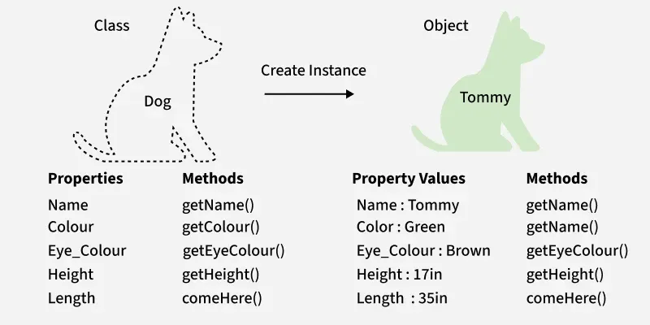
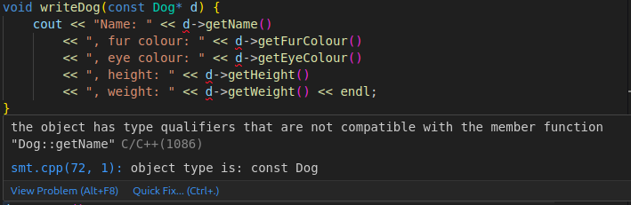

# Functions, classes and templates

## Functions

Functions are reusable blocks of code that execute said block when `called` with or without arguments, based on their definition; They **can** (don't need to) `return` a value, again, based on what they're needed for; General syntax looks something like tis: 
```cpp
T1 functionName(T2 param1, T3 param2 ... Tn paramN) {
    // code block
    return val; // optional based on return type
}
```

Each parameter we define will have to be passed when the function is called, and a function can return any value of type `T1` when it finishes; Example:

```cpp
int sum(int a, int b) {
    return a + b;
}
```

This function takes two `int` parameters, gets their sum and `returns` that value back to the caller; Example of calling this function:

```cpp
int x = 5, y = 10;

int z = sum(x, y); // z = 15
```

Calling the function means writing the `function_name` followed by a set of parenthesis in which we pass the parameters needed, and then using the value `returned` if there is any; A function doesn't need to `return` anything if the `return type` is specified as `void`; This tells the program that the return value is uncertain and thus can't be placed in a type; In any other situation, the `reutrn statement` is required; Example:

```cpp
void sayHello() {
    cout << "Hello" << endl;
}

sayHello(); // writes out 'Hello' and nothing else
```

Return statement ends the function early, meaning that anything bellow the return will not get executed; You **need** to keep this in mind when writing functions, because it can be really helpful and can be a bit frustrating; For example:

```cpp
int sum(int a, int b) {
    return a + b;
    cout << a + b << endl; // will not write anything because we exit the function
}

int setValueTo7(int *a) {
    if (a == nullptr) { // we could also check (!a)
        cout << "Tried assigning to a null pointer" << endl;
        return -1;
    }

    *a = 7;
    return 0;

    // We can use the return statement to return an exit code from a function
    // Here, 0 means success while -1 means something went wrong
    // If 'a' was null, we would enter the if statement and our function would end before reaching *a = 7, conditionally ending the function before undefined behaviour can happen
}

int allNumbersOdd(int *arr, int n, bool *result) {
    if (!arr) return -1;

    // instead of doing 'if (arr)' and indenting the for loop, we can invert the condition so that the rest of the function doesn't need to be unnecessarily indented

    for (int i = 0; i < n; i++) {
        if (arr[i] % 2 == 0) {
            *result = false;
            return 0;

            // we end the function if we find any number that is even, we could have also done it without the bool pointer, but i didn't want to have ambiguity in the function
        }
    }

    *result = true;
    return 1;

    // if everything is ok, our function says its ok
}
```

### Using pointers and references with functions

There is 3 ways to pass a parameter to a function: 

- `by value` - makes a copy of the original value in memory, meaning that the original data cannot be changed from within the function body;
- `by address` - makes a copy of the address of the original value; This allows us to directly access the memory where the original data is stored, changing it directly; Doing this is called a `side effect` and can cause bugs if you're not careful;
- `by reference` - practically identical to passing by address; It makes a copy of the address of the original data, with the only difference being the syntax used to access said data;

Examples:

```cpp
void setValueTo6(int x) {
    x = 6;
    cout << "the address of x: " << &x << endl;
}

void add7(int *x) {
    *x += 7;
    cout << "the address of x: " << &x << endl;
}

void subtract3(int &x) {
    x -= 8;
    cout << "the address of x: " << &x << endl;
}

int main() {
    int a = 0, b = 1, c = 2;

    cout << "The address of a: " << &a << ", ";
    setValueTo6(a);
    cout << "The address of b: " << &b << ", ";
    add7(&b);
    cout << "The address of c: " << &c << ", ";
    subtract3(c);

    cout << "a: " << a << ", b: " << b  << ", c: " << c << endl;
}
```

Output:
```
The address of a: 0x7ffc7d3178cc, the address of x: 0x7ffc7d3178ac
The address of b: 0x7ffc7d3178d0, the address of x: 0x7ffc7d3178a8
The address of c: 0x7ffc7d3178d4, the address of x: 0x7ffc7d3178d4
a: 0, b: 8, c: -6
```

We can see that `a` did not get changed since we only changed the local object in the function, not the original; You can see this by the fact that `a` and `x` have different addresses; `b` got changes but we had to access it's value through the pointer passed; `c` got changed too but if we look at the addresses for `c` and `x` we notice they're the same; This isn't because the address magically appeared in the function, but rather because there is a hidden pointer created for the reference to work, we just can't access it; C++ compiler treats references as aliases, so when we write `x`, it's the same as writing `*x` if x was a pointer, and if we write `&x` its the same as writing just `x`; Example:

```cpp
void func(int a, int *b, int &c) {
    cout << "a: " << a << ", b: " << b << ", c: " << c << endl;
    cout << "&a: " << &a << ", &b: " << &b << ", &c: " << &c << endl;
    cout << "*a: " << "can't" << ", *b: " << *b << ", *c: " << "can't" << endl;
}

int a = 15;
func(a, &a, a);
```

Output:

```
a: 15,               b: 0x7ffdbccce3c4,  c: 15
&a: 0x7ffdbccce3ac, &b: 0x7ffdbccce3a0, &c: 0x7ffdbccce3c4
*a: can't,          *b: 15,             *c: can't
```

Notice how `b` and `&c` are the same, as well as `*b` and `c`;

Passing references and pointers like this can be dangerous due to the `side effects` of changing data outside their scope; This is why we have the `const` keyword; If we look at the function definition for something like `strlen`, a function that returns the length of a string passed to it, we can see that the parameter type is `const char *__s`; This means that the pointer is read-only => `*__s = 'a'` is not allowed and will not compile; The same can be applied to references; We will also see this with the `copy constructor` in `classes`;

### Default parameter values

Not all functions need a value for each of their parameters, some values can have a default value; For example, we can have a function like this:

```cpp
void writeAndStore(char src[], char* dest = nullptr) {
    cout << "Function: " << src << endl;
    
    if (dest) {
        strcpy(dest, src); 
        // function for copying a string from src to dest 
    }
}

int main() {
    char dest[100];

    writeAndStore("Some string");
    writeAndStore("Some string", dest);

    cout << "Main: " << dest << endl;
}
```

Output:

```
Function: Some string
Function: Some string
Main: Some string
```

Here we made a function that can work with only one parameter, the `src`; We made it so that the function will always write an output, and if needed, we can pass a `destination` to the function if we want to save a copy of the written string;

Default parameters always need to come last in the parameter list, the required parameters need to come first for the compiler to know how to parse the function call; Another example:

```cpp
void defaultFunction(int a = 5, int b = 6, int c = 7) {
    cout << "a: " << a << ", b: " << b << ", c: " << c << endl;
}

int main() {
    defaultFunction();
    defaultFunction(8, 9);
}
```

Output:

```
a: 5, b: 6, c: 7
a: 8, b: 9, c: 7
```

If we want to set the value of just `c`, we need to set the values of `a` and `b` first;

### Function name overloading

Function name overloading means that we can define multiple behaviours for the same function name; For example if we want to have a function that prints out a whole number, we could create two implementations for it: one that takes an `int` and one that takes a `double`; In the double variation we can then round the number and write it out; Example:

```cpp

void printWhole(int a) {
    cout << "Int implementation: " << a << endl;
}

int printWhole(double d) {
    int retVal = round(d);
    cout << "Double implementation: " << retVal << endl;
    return retVal;

    // overloaded functions can have different return types
}

int main() {
    printWhole(5);
    printWhole(5.67);
}
```

Output: 
```
Int implementation: 5
Double implementation: 6
```

Functions defined in the same scope need to differ in their signature; A function signature consists of a `function name` and a `parameter list` (number and type of parameters);

This means that we can have a function `toPower` implemented as `int toPower(int x)` which would just square the number `x`, and also a `int toPower(int x, int y)` which would raise `x` to the power of `y`; I am aware this could've been done with a default value for `y` but I can't think of a better example rn;

```cpp
int toPower(int x) { return x * x; }

int toPower(int x, int y) {
    if (y == 0) return 1;
    for (int i = 1; i <= y; i++) x *= x;
    return x;
}
```

One last thing to mention; When the return type of a function is `void`, it doesn't mean that the return keyword

## Classes, structs and unions

### Classes

Classes represent a way to combine multiple simple data types into one complex type with custom `data encapsulation` logic (what can and can't be accessed); They allow us to design a blueprint that mimics an object we want to represent through the use of `member variables` (`fields`) and `member functions` (`methods`); Visually, it looks something like:



Source: [GeeksForGeeks](https://www.geeksforgeeks.org/cpp/object-oriented-programming-in-cpp/)

Code example:

```cpp
enum Colour {
    NONE, RED, GREEN, BLUE, BLACK, YELLOW, WHITE, BROWN, SOME_COLOUR
};

class Dog {
    string name;
    Colour furColour;
    Colour eyeColour;
    double height;
    double weight;

public:
    string getName() { return name; }
    Colour getFurColour() { return furColour;}
    Colour getEyeColour() { return eyeColour;}
    double getHeight() { return height; }
    double getWeight() { return weight; }
};
```

Here, we defined 5 `member variables`, and 5 `member functions`; We can also see an `access modifier` **`public`**; Class definitions also need to end with a `;`;

#### Objects

Objects are `instantiated` classes; Since a class doesn't take any space in memory because it is just a blueprint, when we want to use it we need to instantiate it, meaning we have to take up memory for each `field` in the class; This means that we take up `32 bytes` for the string, `4` for `furColor` and another `4` for `eyeColour`, and then `8` for `height` and `8` for `weight`; All in all, each `Dog` object when instantiated will require `56 bytes` of memory;

We can access data stored in an object using the `.` operator; Doing `object_name.field_name` or `object_name.method_name()` will attempt to access said field / call said function; I say attempt since `access modifiers` can restrict what we can and can't see on an object;

<hr>

#### Access modifiers

**Access modifiers** are special tags we place inside a `class` or `struct`'s definitions to change where their members are visible from; `Access modifiers` include:

- `private` - the default modifier for all `class` members; It restricts access of private members outside the class itself; We can see that in our `Dog` example, we are able to read the values of `private fields` **name, furColour, eyeColour, height, weight** from their respective member function, but if we tried to read their values directly from `main`, we would instead get a compilation error;
- `public` - the default modifier for all `struct` members; It is also the only difference between `clases` and `structs`; `public` fields allow for **read/write** permissions to anyone anywhere, and `public` methods can be called from anywhere, no restrictions;
- `protected` - will be explained in [inheritance](#inheritance)

Setting an access modifier for a field or function is done by doing `modifier_name:` on a line; After that line, every member will have that `access modifier` applied to it;

<hr>

#### Instantiating and constructors

Instantiating is done through a `constructor`, a special method that is called when a new `instance` of a `class` is created; It is used to set initial values for `class` fields or do custom logic when a new `instance` gets made; By default, if we don't specify anything, C++ provides an `empty constructor`, a constructor that takes no parameters and does nothing; Example of calling an empty constructor:

```cpp
Dog d;
```

This will create a `Dog` instance in memory but will not set the values of fields, meaning that what we read out of them afterwards is completly **unpredictable**; Example:

```cpp
Dog d;
cout << d.getHeight() << endl << d.getWeight() << endl;
```

Output: 

```
2.11653e+214
6.95298e-310
```

This is because `height` and `weight` don't change data when they get allocated, meaning they contain the bytes that were in memory before the object got made, and then try to interpret it as a `double`; We can create our own empty `constructor` to stop this `unpredictability` from happening; A `constructor` can be defined using just the `class_name` followed by **parenthesis** that `list parameters` required; Example:

```cpp
class Dog {
    // ...fields
public:
    Dog() {
        name = "";
        furColour = NONE;
        eyeColour = NONE;
        height = 0;
        weight = 0;
    }
};
```

Writing the values of `height` and `weight` now will give us `0` and `0`;

If we wanted to initialize our `Dog` with some values though, we would need to make a *"normal"* constructor, example:

```cpp
class Dog {
    // ...fields
public:
    // empty constructor
    Dog(string _name, Colour _furColour, 
        Colour _eyeColour, double _height, double _weight) 
    {
        name = _name;
        furColour = _furColour;
        eyeColour = _eyeColour;
        height = _height;
        weight = _weight;
    }
};
```

Since multiple constructors can exist for a single class, we need to make sure they differ in their `signature`, just like regular functions; `Function signature` consisted of a `name` and a `parameter list`, but since we don't have `names` for constructors, we need to make them different with the `parameter list`; In our example, this is done through the length of the param list, first constructor having **0** parameters and the second having **5**; Example:

```cpp
Dog d1;
Dog d2("Brian", WHITE, BLACK, 110, 50);
```

This creates two objects, one using the default values for all fields like we set in the `default constructor`, and the other containing custom data we passed; If we were to make a function `writeDog`, we could see the difference:

```cpp
void writeDog(Dog d) {
    cout << "Name: " << d.getName()
        << ", fur colour: " << d.getFurColour()
        << ", eye colour: " << d.getEyeColour()
        << ", height: " << d.getHeight()
        << ", weight: " << d.getWeight() << endl;
}

int main() {
    writeDog(d1);
    writeDog(d2);
}
```

Doing this will give us the following output:

```
Name: , fur colour: 0, eye colour: 0, height: 0, weight: 0
Name: Brian, fur colour: 6, eye colour: 4, height: 110, weight: 50
```

It is also important to mention `constructor initializer lists`; They are a special way to initialize `fields` in a class, before the body of the constuctor even runs; Example:

```cpp
class Dog {
    // ...fields
public:
    Dog(string _name, Colour _furColour) 
        : name(_name), furColour(_furColour) { }
}
```

This will put values into `name` and `furColour`, but more importantly, it will immediately initialize them with said values; Since before the constructor body runs, C++ already has to allocate the space needed for the object; This means that all values get initialized before we can set them, having to change them after; Using `constructor initializer listst`, we can allocate with already initialized values, speeding up the process drastically for larger types; For small types like `Colour` or `string`, this doesn't make too big of a difference, but if we had members that are objects of other classes, it would be night and day;

Doing `constructor initializers` automatically runs a constructor for the needed type (further tying into the whole object as member thing); This can work for **any type** since *technically* every type has a constructor - meaning we can initialize an `int` value using `int a(5)` instead of `int a = 5` (mega cursed if you ask me);

Anyway, right now there is no way to change what our objects contain within themselves after getting created since we only defined `getter` functions and no `setter` functions, and all our fields are `private`; `Setter functions` for our dog would look something like:

```cpp
class Dog {
    // ....
public:
    void setName(string _name) { name = _name; }
    void setFurColour(Colour _furColour) { furColour = _furColour; }
    void setEyeColour(Colour _eyeColour) { eyeColour = _eyeColour; }
    void setHeight(double _height) { height = _height; }
    void setWeight(double _weight) { weight = _weight; }
}
```

We can now use these `setter functions` to set the individual values on an object after it was already created; It's worth noting that functions don't take up memory on an object, they're **not** a member of the object, they're a member of a class; Our `Dog` can have hundreds of functions defined for it, a `bark`, `loudBark`, `softBark`, `softerBark`, `softestBark` etc. and each `Dog` object created would still take up only `56 bytes`; We'll get to that in a bit;

Before that though, we need to fix the `writeDog` function since it is ***really*** bad; First of all, we are passing the object by value; This is inefficient since it means that we need to copy `56 bytes` onto the stack, and thus the recommended way is to copy by `adress` or by `reference`, which will copy over only `8 bytes` of data; Since this poses a potential `side effect` problem if not implemented carefully; We can use a `const pointer` or `const reference` to make the value `read-only`; Example:

```cpp
void writeDog(const Dog* d) {
    cout << "Name: " << d->getName()
        << ", fur colour: " << d->getFurColour()
        << ", eye colour: " << d->getEyeColour()
        << ", height: " << d->getHeight()
        << ", weight: " << d->getWeight() << endl;
}

void writeDog(const Dog &d) {
    cout << "Name: " << d.getName()
        << ", fur colour: " << d.getFurColour()
        << ", eye colour: " << d.getEyeColour()
        << ", height: " << d.getHeight()
        << ", weight: " << d.getWeight() << endl;
}
```

We have a couple of issues here, but before that, let's discuss the `pass by pointer` function; We can notice that we access our `getter functions` a bit differently now; Instead of doing the `.` operator, we are using the `->` operator; This is because the `.` requires an `object` to be used on and we are giving it a `pointer`; A way to go around this would be to `dereference the pointer`, something like `(*d).getName()`, and this is exactly what `->` does, just quicker and prettier; 

In a way, it's simillar to the `[]` operator we use on `arrays`, just a shorter way to **dereference** a value and access a specific part of data; Fun *(impractical)* trick at the end of the [segment](#accessing-object-fields-without-operators) :);

Now for the issues; Firstly, we can't have function overloads where one is `pass by reference` and the other `pass by value`; This is because the compiler doesn't know which one to invoke when we call `writeDog(d1)`, both fit the function call; The second issue is that this actually won't compile with our current implementation; Had we been accessing `fields` directly, there would be no issue with these two functions, but since we're doing it through a function, C++ has no way of knowing (currently) if the function is actually changing any state on the object;



C++ currently doesn't know if our `getter` changes anything or not; The way we can fix this issue is by redefining our `getters`; Currently, they look something like <br>`void getName() { return name; }`<br>We can tell C++ that this function does not change any state on the object by using `const` on the `function body`, so something like `void getName() const { return name; }`; 

If we tried this with a `setter` (`string setName(string val) const { name = val; }`), we would get an error since a `constnt body` function cannot change member variables (reasign their values) and can instead only change [static fields](#static-members), [mutable fields](#mutable-fields), values passed through pointers;

Our new getters should look like this:

```cpp
string getName() const { return name; }
Colour getFurColour() const { return furColour;}
Colour getEyeColour() const { return eyeColour;}
double getHeight() const { return height; }
double getWeight() const { return weight; }
```

This will remove the error and allow our `pass by pointer/reference` functions to ***`function`*** (🤣);

Let's now take a look at how we implemented the `writeDog` function; As you can probably guess, it doesn't need to be defined as a `global function`, but rather as a `member function`; So we could've done something like:

```cpp
class Dog {
    // ... fields
    // ... getters
    // ... setters
public:
    void write() {
        cout << "Name: " << name
            << ", fur colour: " << furColour
            << ", eye colour: " << eyeColour
            << ", height: " << height
            << ", weight: " << weight << endl;
    }
};
```

What we've done now is called `single responsibility prinicple` (not really but a step in the right direction), it is a part of `SOLID` principles, 5 principles that describe clean `object-oriented` coding practices; Anyway, **SRP** says that each class should be responsible for itself; Imagine if we had more classes other than `Dog` - `Person`, `School`, `Car`, `Tree` etc. Why should `Person` be responsible for `Dog`? Other than that, if we had to define each `write` function as a global function, we'd bloat the file and would have to either do `function name overloading` or name each function `write*Class*`; Now add multiple functions of this type (like `Read` or something) and you get a mess that is hard to keep track of and even harder to maintain, so even thought the end result is the same, one option is clearly superior;

This was a leadup into the introduction to one keyword that is often missinterpred, the `this` keyword;

#### This keyword

`this` is a *"variable"* available inside `member functions` of classes and structs that represents the current object; It is a hidden parameter that is implicitly passed to each `member function` when it gets called; This has the type of `Class_name*`; 

We have already used `this` even though we didn't explicitly write it; This is because the assumption for the `write` (or any `get`) function in the `Dog` class is that it is parameterless, but this is **false**; As i said before, `this` is passed implicitly - when we do `d1.write()`, `d1` is the parameter used for `this` since all member functions are just global functions with a different calling convention; This is more noticable when we compare the following two functions:

```cpp
void writeDog(const Dog* d) {
    cout << "Name: " << d->getName()
        << ", fur colour: " << d->getFurColour()
        << ", eye colour: " << d->getEyeColour()
        << ", height: " << d->getHeight()
        << ", weight: " << d->getWeight() << endl;
}

class Dog {
    // ...
    void write() {
        cout << "Name: " << name
            << ", fur colour: " << furColour
            << ", eye colour: " << eyeColour
            << ", height: " << height
            << ", weight: " << weight << endl;
    }
};
```

These two are very simillar (one having access to private members), but they both take one argument and that argument is the pointer to a `Dog` object; Let's take a look at one of our setters:

```cpp
class Dog {
    void setHeight(double _height) { height = _height; }
}
```

I made the parameter `_height` have a different name from the field `height` for a reason, but that reason can be revealed now; If I named the parameter passed to the function `height` as well, the body would be `{ height = height }` which would only change the local copy of the parameter, our function can't even see the field `height`; The only way to get around this is to do `{ this->height = height }`; This way, `this->height` refers to the actual field while just `height` refers to the parameter; Doing `this->height` would be *"100% correct"*, but since it's tedious, the compiler does it for us (if anyone has experience with `Python`, look up OOP in it and you'll see what im talking about); So our new setter is:

```cpp
class Dog {
    void setHeight(string height) { this->height = height; }
}
```

This is not the only use for the `this` keyword, it can also be used as a return value from a function; Let's take a look at the following example:

```cpp
class Clock {
    int hours, minutes, seconds;

public:
    Clock() { hours = minutes = seconds = 0; }

    void setHours(int hours) { this->hours = hours; }
    void setMinutes(int minutes) { this->minutes = minutes; }
    void setSeconds(int seconds) { this->seconds = seconds; }

    void writeTime() {
        cout << "It is currently " << hours << ":" 
            << minutes << ":" << seconds << endl; 
    }
};

int main() {
    Clock c;
    c.setHours(5);
    c.setMinutes(33);
    c.setSeconds(52);
    c.writeTime();
}
```

As we can see, we need to set the time independetly, calling each function on a seperate line through the `c` object again and again; But, what if instead of void we returned a reference (or pointer) to the current object we're working with; So let's rewrite the setters to something like:

```cpp
Clock& setHours(int hours) { this->hours = hours; return *this; }
Clock& setMinutes(int minutes) { this->minutes = minutes; return *this; }
Clock& setSeconds(int seconds) { this->seconds = seconds; return *this; }
```

What this now allows us to do is the following:

```cpp
int main() {
    Clock c;
    c.setHours(5).setMinutes(33).setSeconds(20).writeTime();
}
```

This is called `function chaining` and is found in many libraries; It is worth noting that in order for function chaining to work, the function needs to return a reference or a pointer; If it returned just an object, not only would we have to copy over x bytes of space each time, but it would also not change the properties of the original object; For example:

```cpp
// imagine we no longer return a reference but just a Clock
Clock c;
c.setHours(5) // sets hours on c to 5
    .setMinutes(33) // sets the minutes of a new object from the setHours method
    .setSeconds(20) // sets seconds on the object of setMinutes
    .writeTime(); // prints "It is currently 5:33:20"
c.writeTime(); // prints "It is currently 5:0:0"
```

This happened because `setMinutes` and `setSeconds` got called on coppies of the original object, thus changing the copy and not the original;

### Static members

#### Accessing object fields without operators

Just like I mentioned earlier, `class objects` store their fields sequentially in memory; This means that ***technically*** we could access each property by manipulating pointers, just like what we did for arrays (`*(arr + n) == arr[n]`); For fields though, this is ***EXTREMELY*** impractical since we know that all values in an array are of the same type, while that guarantee does not exist on object fields; What I mean by this can be displayed in the following examples;

For this to work (if you want to run it yourself) we need to set the `public` modifier on the `fields` in our `Dog` class; Example:

```cpp
Dog d1("Brian", WHITE, BLACK, 110, 50);

cout << setbase(10) << 
    "Base pointer:  " << &d1 <<
    ",\nname:          " << &d1.name << 
    ",\nfur colour:    " << &d1.furColour <<
    ",\neye colour:    " << &d1.eyeColour <<
    ",\nheight:        " << &d1.height <<
    ",\nweight:        " << &d1.weight << endl;
```

Result:

```
Base pointer:  0x7fff696bf950,
name:          0x7fff696bf950,
fur colour:    0x7fff696bf970,
eye colour:    0x7fff696bf974,
height:        0x7fff696bf978,
weight:        0x7fff696bf980
```

We can see that `name` has the same address as the object `d1` itself; This is the same with the arrays where the array pointer carries the address of the first element; After adding `32` (sizeof(string)) to the base address (32 is 20 in hexadecimal), we get the address of the `fur color` field, after which we can add `4` bytes and get the `eye colour` etc. Table representation:

|   memory address   |  code identifier  | value stored at the location |
| :----------------: | :---------------: | :--------------------------: |
| **0x7fff696bf950** | **&d1, &d1.name** |            **??**            |
| **0x7fff696bf954** |      **//**       |            **??**            |
| **0x7fff696bf958** |      **//**       |            **??**            |
| **0x7fff696bf95b** |      **//**       |            **??**            |
| **0x7fff696bf960** |      **//**       |            **??**            |
| **0x7fff696bf964** |      **//**       |            **??**            |
| **0x7fff696bf968** |      **//**       |            **??**            |
| **0x7fff696bf96b** |      **//**       |            **??**            |
| **0x7fff696bf970** | **&d1.furColour** |         **WHITE(6)**         |
| **0x7fff696bf974** | **&d1.eyeColour** |         **BLACK(4)**         |
| **0x7fff696bf978** |  **&d1.height**   |           **110**            |
| **0x7fff696bf97b** |      **//**       |            **0**             |
| **0x7fff696bf980** |  **&d1.weight**   |            **50**            |
| **0x7fff696bf984** |      **//**       |            **0**             |

Or:

| memory address |  code identifier  | value stored at the location |
| :------------: | :---------------: | :--------------------------: |
|    **base**    | **&d1, &d1.name** |          **Brian**           |
| **base + 32**  | **&d1.furColour** |         **WHITE(6)**         |
| **base + 36**  | **&d1.eyeColour** |         **BLACK(4)**         |
| **base + 40**  |  **&d1.height**   |           **110**            |
| **base + 48**  |  **&d1.weight**   |            **50**            |

This means that we can access each `field` (even if they're private) by doing the following:

```cpp
Dog d1("Brian", WHITE, BLACK, 110, 50);
cout << "The height of the dog is: " << *(double*)((char*)&d1 + 40) << endl;
```

Taking it from the top, first we convert the pointer from `Dog*` to `char*` so that we can access each byte individually, instead of jumping by `56 * n bytes` where `n` is the number added to base pointer; After doing that, we convert the resulting pointer value back to `double*` so that when we dereference it with `*`, we read the `8 bytes` that represent the `height` of the dog;

If we were to put back private on our `fields`, we would notice that this code still works; This means that `access modifiers` exist only in the context of the compiler, and not in the actual executable file; 

All in all, field names just hold the offset relative to the base pointer to which we need to go to in order to retrieve the data stored;